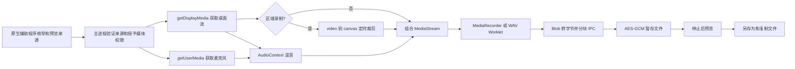
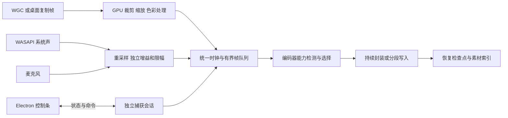

# 截图、录屏、录音与 GIF 工具调研：功能、实现机制与 Clipper 审计

调研日期：2026-10-08。对象：Snipaste、ShareX、PixPin、Bandicam、ScreenToGif，以及 Clipper 当前工作区。

本文交付的是调研和改进设计，不表示已经完成重构。Clipper 的审计基准是版本 **0.50.20 的当前工作树**；仓库 HEAD 为 `c99381b38c8f05d8c1eeb66eb8007806d4372387`，工作区还存在未提交修改，因此不能只用这个提交复现全部审计结果。

## 1. 核心判断

Clipper 目前有可以工作的截图、图片编辑、录屏和录音基础，但还没有形成成熟捕获工具的完整体验。最明显的差距是：截图选区和编辑脱节，录制数据跟控制界面的生命周期绑定，音频控制过于简单，没有滚动截图和 GIF 制作流程，部分错误处理会丢掉已经录下来的内容。

更严重的是几个可由代码直接定位的问题：

1. **窗口截图使用受限尺寸的缩略图作为最终图片**，不是明确的原始分辨率捕获。
2. **WAV 的小分块与 10,000 分块上限相互冲突**：按代码计算，48 kHz 下约 14.2 分钟就会触顶，而公共时长上限是 60 分钟。
3. **写入跟不上等错误走“失败并清除”路径**，没有优先停止并保存已经完成的部分。
4. **录制中直接禁止截图**，限制了实际很常见的“边录演示边截关键画面”场景。
5. **区域录制通过定时器重绘画布取帧**，没有根据源视频帧到达来驱动；实际重复帧、抖动和开销需要测量。

这些才是应当批评的实现选择。把所有问题归结为“Electron 太慢”，或者为了显得专业把全部功能重写成 C++，都缺少依据。现有代码里的矢量操作历史、异步 PNG 编码、受限队列、加密暂存、原子导出、来源身份验证，有应当保留的价值。

五款软件各自最值得学习的方面：

| 软件 | 核心能力 | 对 Clipper 最有价值的启发 |
| --- | --- | --- |
| Snipaste | 精确截图、就地标注、贴图参考 | 减少步骤；选区、标注、复制、贴图是一条连续流程 |
| ShareX | 捕获、处理、保存、上传的任务组合 | 把捕获结果和后续动作解耦，复用同一份结果 |
| PixPin | 截图、长截图、贴图和短录制的统一入口 | 普通录制与快速录制服务不同目标；结果预览有编辑价值 |
| Bandicam | 持续录制、编码、声音与设备控制 | 声音和录制可靠性是一等功能；异常恢复不是附加装饰 |
| ScreenToGif | 帧级编辑、动画制作和导出优化 | GIF 是一个素材与时间轴流程，不能只添加一个文件后缀 |

以上定位来自下文官方文档和源码；改进取舍属于本文分析。

## 2. 调研方法与证据边界

### 2.1 证据分级

| 标记 | 含义 | 本文如何使用 |
| --- | --- | --- |
| 官方说明 | 厂商或项目正式文档描述的能力 | 说明功能存在、入口和限制；不等同于实测性能 |
| 源码确认 | 在指定版本或提交中实际读到的实现 | 可说明技术路径、数据结构和控制逻辑 |
| 工程推导 | 根据已确认代码、协议或算法推导 | 标出前提，不能当成运行测量结果 |
| 设计建议 | 对 Clipper 的候选方案 | 尚未实施，必须经过原型和验收 |
| 待实测 | 静态审计不能证明的行为 | 不虚构 CPU、内存、延迟、帧率或质量对比 |

本次查阅了官方说明、公开源码、微软平台文档和 Clipper 本地源码；**没有安装并逐项操作五款客户端，也没有进行同机性能跑分**。没有访问闭源软件的内部实现，不能声称已经知道 Snipaste、PixPin、Bandicam 的精确底层算法、线程模型或录制 API。

### 2.2 版本与来源基准

| 对象 | 本次观察到的基准 | 重要边界 |
| --- | --- | --- |
| Snipaste | 官方更新文档顶部版本 v2.11.3；Snipaste 2 免费/专业版功能表 | 不把专业版能力算进免费版；反馈仓库不等于应用源码 |
| ShareX | 已发布 v21.0.0，2026-07-03；源码 `d2502561f63fc3ff502cacd91514e3f7f2948c74` | 正式版与新开发分支的录制架构分开讨论 |
| ShareX 开发分支 | `b9710517ee202228d05e35df7f4e8ff8c69b2270` | 原生录制库是这个快照中的开发成果，不冒充 v21 已交付功能 |
| PixPin | 官方正式版日志标题 v3.5.5.1，2026-09-11；导航简称 3.5.5 | 官方页面有历史版本说明，优先采用较新日志修正旧教程 |
| Bandicam | 官方页面显示 Bandicam 2027，v27.0.6.2686，2026-09-09 | “2027”是产品命名；官网显示的发布日期仍是 2026 年 |
| ScreenToGif | 已发布 2.43.2，2026-07-28；源码 `a4d0a67c2131cd048ceec86cd40afc2f1a06f2fd` | 官网功能页已跳转到 N-Studio，不把后继产品能力算到 ScreenToGif 2.x |
| Clipper | 0.50.20 当前工作树 | 本文关注捕获相关模块，不是全仓库性能认证 |

版本依据：[Snipaste 更新日志](https://docs.snipaste.com/zh-cn/changelog)、[ShareX v21.0.0](https://github.com/ShareX/ShareX/releases/tag/v21.0.0)、[PixPin 3.5.5.1](https://pixpin.cn/docs/official-log/3.5.5.1)、[Bandicam 官方设置文档与版本入口](https://www.bandicam.com/guide/settings-audio/)、[ScreenToGif 2.43.2](https://github.com/NickeManarin/ScreenToGif/releases/tag/2.43.2)。

### 2.3 开源与范围

ShareX 公开仓库采用 GPL-3.0；ScreenToGif 采用 MS-PL。Snipaste、PixPin、Bandicam 本次未找到可供审计的完整应用源码。参考交互、算法思想与复制第三方代码是不同的事情；若以后复用具体代码或发行组件，需核对该版本许可证、依赖和第三方声明，本文不把“开源”解释为可以任意摘抄。[ShareX 仓库](https://github.com/ShareX/ShareX)、[ScreenToGif 仓库](https://github.com/NickeManarin/ScreenToGif)

**OCR 不在 Clipper 后续范围内。** 竞品确有 OCR、公式或表格识别时，本文会如实记录，但遵守此前“全面去掉 OCR”的要求，不把重新引入 OCR 作为改进任务。

## 3. 五款软件的功能与实现

### 3.1 Snipaste：把截图做成随手可用的参考材料

#### 已确认功能

| 类别 | 功能 | 用户价值 |
| --- | --- | --- |
| 选区 | 矩形、窗口/界面元素检测、精确移动、放大镜与取色 | 少拖一次，少裁一次，避免差几个像素 |
| 标注 | 图形、线条/箭头、画笔、记号笔、文字、马赛克/模糊、撤销重做 | 在截图状态中直接说明重点 |
| 历史与输出 | 截图历史重放、快捷保存、复制、贴图 | 不必先进入一个管理页面 |
| 贴图 | 图片/文字等剪贴板内容置顶；缩放、旋转、镜像、透明度、鼠标穿透、分组 | 做参考图、临时备忘、对照和拼图 |

官方入口以截图和贴图快捷键串起这些操作，重点是短路径与精确控制。[Snipaste 官网](https://www.snipaste.com/)、[基础操作](https://docs.snipaste.com/zh-cn/getting-started)

专业版在基础流程上增加父/子元素检测、多选贴图、贴图裁剪、序号和放大镜标注等。OCR、二维码等也在专业版功能表中，但不纳入 Clipper 计划。商业使用条件与个人免费不同。[专业版功能对比](https://docs.snipaste.com/zh-cn/pro)

#### 实现能确认到什么程度

可以确认交互和功能，不能确认内部捕获引擎。官方反馈仓库不是应用源代码。FAQ 把滚动截图和 GIF 录制引向功能讨论，因此本次**不将它们记作已核实的完整创作能力**；也不能把能够贴出 GIF 文件混同于能够录制、编辑并导出 GIF。[Snipaste FAQ](https://docs.snipaste.com/zh-cn/faq)

从产品行为可以推导出 Clipper 应考虑的结构，以下是设计推导，不是对 Snipaste 内部的断言：

1. 截图会话包含冻结背景、选区、标注对象和输出动作，直到用户完成或取消才结束。
2. 界面元素检测应在有时限的后台查询中完成，失败降级到窗口边界或手动选区；不能阻塞鼠标拖动。
3. 放大镜放大的是源图片的实际像素，指针坐标必须和截图像素坐标准确换算。
4. 贴图应保存内容、变换和窗口状态；隐藏、关闭显示和永久销毁要区分。
5. 标注图形应保持可编辑对象，导出才合成图片，而不是每画一笔就抹进原图。

#### Clipper 应学什么

最应学的是“选完立即可以标注、复制或贴出”。目前 Clipper 要先产生一条历史记录，再进入独立编辑器，增加了与用户目标无关的操作。贴图也还只是可移动、缩放、关闭的图片/文字窗口，与完整的参考图工具有明显差距；详见第 6 节。

### 3.2 ShareX：捕获结果是任务链的输入

#### 已确认功能

| 类别 | 功能 |
| --- | --- |
| 捕获 | 全屏、窗口、显示器、区域、上次区域、滚动截图、自动捕获、视频和 GIF 录制 |
| 捕获后 | 标注、图像处理、复制、保存、贴图、打印、外部动作、上传等可组合任务 |
| 上传后 | 复制或打开结果链接等独立任务 |
| 工具 | 图像/视频转换、GIF 制作、裁剪等辅助工具 |

这些入口体现了“先获得素材，再选择处理和交付”的组织方式。[ShareX 官网功能表](https://getsharex.com/)

编辑器有文字、箭头、形状、自由绘制、序号、模糊/像素化、放大等工具；贴图具备自己的缩放和显示操作。自定义上传器配置请求、认证字段与响应提取，使上传服务适配不必侵入截图工具本身。[图像编辑器](https://getsharex.com/docs/image-editor)、[贴图](https://getsharex.com/docs/pin-to-screen)、[自定义上传器](https://getsharex.com/docs/custom-uploader)

#### 正式版 v21 的录制实现：源码确认

指定版本中，`ScreenRecorder.cs` 将 FFmpeg 输出交给命令管理器；另有截图帧进入磁盘缓存的 GIF 路径。`FFmpegOptions.cs` 的默认视频来源是 `gdigrab`，默认视频编码器是 `libx264`。命令生成器同时有 `ddagrab` 等来源分支，因而不能概括成“ShareX 只有 GDI”。硬件编码参数也有 NVENC、QSV、AMF 分支。

源码：[ScreenRecorder.cs](https://github.com/ShareX/ShareX/blob/d2502561f63fc3ff502cacd91514e3f7f2948c74/ShareX.ScreenCaptureLib/ScreenRecording/ScreenRecorder.cs)、[FFmpegOptions.cs](https://github.com/ShareX/ShareX/blob/d2502561f63fc3ff502cacd91514e3f7f2948c74/ShareX.ScreenCaptureLib/ScreenRecording/FFmpegOptions.cs)、[命令生成](https://github.com/ShareX/ShareX/blob/d2502561f63fc3ff502cacd91514e3f7f2948c74/ShareX.ScreenCaptureLib/ScreenRecording/ScreenRecordingOptions.cs)。

这条路径的意义是把格式、捕获源和编码器暴露成明确配置。代价是依赖外部组件、参数兼容和版本管理，不能只抄一段 FFmpeg 命令就认为录制问题解决了。

#### 滚动截图实现：源码确认

`ScrollingCaptureManager.cs` 实现了滚动至顶部、滚轮/按键/窗口消息滚动、连续截帧和停止判断。拼接阶段比较重叠像素行，考虑底部忽略区；在找不到当前匹配而使用之前最佳匹配估计时，会标成部分成功。官方说明也要求正确选择滚动范围。[滚动截图说明](https://getsharex.com/docs/scrolling-screenshot)、[拼接源码](https://github.com/ShareX/ShareX/blob/d2502561f63fc3ff502cacd91514e3f7f2948c74/ShareX.ScreenCaptureLib/ScrollingCaptureManager.cs)

这不是“每滚一下就向下追加图片”。它需要知道两张图重叠多少、哪些内容不能参与匹配，以及什么时候已经到达底部。源码的逐行精确比较也有边界：动画、阴影变化和重复内容可能让匹配变差。Clipper 可以借鉴流程，但不应照搬为唯一算法。

#### 新开发分支：独立的原生录制方向

所查开发快照的 `ShareX.ScreenRecordingLib` 描述了另一条管线：WGC 获取 D3D11 帧，WASAPI 采集系统/麦克风音频，QPC 对齐时间，GPU 转换为 NV12，Media Foundation 写 H.264/AAC MP4。它还要求检查实际选中的编码器与硬件路径；进程级音频在该文档中属于后续方向。[原生录制库设计说明](https://github.com/ShareX/ShareX/blob/b9710517ee202228d05e35df7f4e8ff8c69b2270/ShareX.ScreenRecordingLib/README.md)

**版本区分很重要：这不是 v21.0.0 正式版的实现说明。** 值得参考的是让捕获、音频、时钟、编码、UI 分工明确，以及对“实际用了什么编码器”提供诊断证据。

#### Clipper 应学什么

将截图结果作为共享素材，在同一会话中执行标注、复制、保存、贴图、历史和现有图床上传。默认只做用户选择的动作；上传必须有明确入口，不能因为参考 ShareX 就让所有截图自动出网。

### 3.3 PixPin：统一捕获入口，同时区分两种录制目标

#### 已确认功能

静态截图包括精确辅助、窗口/元素检测、选区历史及标注。3.5.5.1 日志增加或确认了多区域、自由形状、折线、多窗口截图和 GIF/WebP 动图贴图；这些是较新正式版的能力。[静态截图](https://pixpin.cn/docs/capture/static-capture)、[3.5.5.1 更新日志](https://pixpin.cn/docs/official-log/3.5.5.1)

| 类别 | 功能及限制 |
| --- | --- |
| 长截图 | 纵向/横向滚动、匹配状态与预览、裁切范围；自动裁剪有会员限制 |
| 标注 | 常见图形、文字、序号、荧光笔、马赛克/模糊及其他效果 |
| 贴图 | 图像、文字、文件等内容作为独立参考；分组与显示管理 |
| 普通录制 | 保留素材，结束后预览/处理，再导出 MP4、GIF、WebP |
| 快速录制 | 边录边编码，面向尽快得到 MP4 文件 |
| 录制增强 | 系统声/麦克风、暂停、标注；键鼠显示、摄像头等部分能力有会员限制 |

依据：[长截图](https://pixpin.cn/docs/capture/long-capture)、[标注处理](https://pixpin.cn/docs/mark/mosaic)、[贴图](https://pixpin.cn/docs/pin/base-use)、[屏幕录制](https://pixpin.cn/docs/capture/gif-capture2)。OCR、表格和公式识别也存在，作为竞品能力记录，排除在 Clipper 计划外。

#### 官方明确说明的实现策略

这里可以确认策略，不能确认内部代码：普通录制保存适合编辑的素材并在结束后编码；快速录制实时编码。当前配置说明称快速录制从 3.4 起可选画质，因此不能沿用旧页面“快速模式只有原始画质”的说法。3.5.5.1 正式版日志还确认录制/回放意外退出后的恢复提示，以及 MP4 导出的 GPU 加速和硬件测试。[截图与录制配置](https://pixpin.cn/docs/configuration/screenshot)、[正式版日志](https://pixpin.cn/docs/official-log/3.5.5.1)

普通录制的剪辑教程描述的是会员可用的头尾端点裁切，并不等于任意删除中间片段的完整视频编辑器。其产品优势是降低短演示制作成本，不应据此假定它等同专业剪辑软件。[录制说明](https://pixpin.cn/docs/capture/gif-capture2)

长截图文档强调滚动重叠和内容匹配，对重复空白、固定区域、动态内容、多滚动区域给出限制。宣传的极长画面长度不是通用图片查看器或内存上限的保证。[长截图文档](https://pixpin.cn/docs/capture/long-capture)

#### 一个容易忽略的边界

PixPin 官方明确说 UI 元素检测依赖目标应用提供的接口，接口缺失或被屏蔽时只能识别窗口。它也给出 HDR 场景不同截图策略的质量取舍。成熟软件会提供降级和解释，不能用一个“智能检测”按钮承诺所有软件都准确识别。[捕获配置](https://pixpin.cn/docs/configuration/screenshot)

#### Clipper 应学什么

用户选择“做一段动图”时，应得到预览、截断头尾、尺寸/帧率调整和导出；选择“持续录视频”时，应立即开始可靠写入文件。两条路径可以共享来源选择、音频和时钟，但不应强迫长录制保存全部无压缩帧，也不应强迫 GIF 用户先保存视频再自己找转换入口。

### 3.4 Bandicam：录制的重点是控制、编码和可靠结束

#### 已确认功能

Bandicam 面向屏幕、游戏、摄像头/设备和纯音频。游戏录制官方列出 DirectX、OpenGL、Vulkan；这不证明 Clipper 需要实现游戏注入，也不证明 Bandicam 内部采用哪种具体 Hook。[官网](https://www.bandicam.com/)、[游戏录制](https://www.bandicam.com/game-recorder/)

| 类别 | 功能 |
| --- | --- |
| 视频 | 区域/屏幕、设备、暂停、倒计时；光标/点击、摄像头、文字/Logo 等叠加 |
| 编码 | AVI/MP4，尺寸、帧率、CFR/VFR、码率/质量、多个视频编码器 |
| 加速 | NVIDIA NVENC、Intel Quick Sync、AMD 等硬件编码路径 |
| 音频 | 系统声音、麦克风或两者；独立调节、麦克风处理；纯音频输出 MP3/WAV |
| 自动化 | 定时开始、周期安排、自动结束等 |
| 恢复 | BandiFix 与录制索引帮助修复异常终止产生的文件 |

依据：[视频设置](https://www.bandicam.com/guide/settings-video/)、[硬件加速](https://www.bandicam.com/support/tips/hardware-acceleration/)、[音频设置](https://www.bandicam.com/guide/settings-audio/)、[录音](https://www.bandicam.com/audio-recorder/)、[定时录制](https://www.bandicam.com/guide/scheduled-recording/)、[BandiFix](https://www.bandicam.com/guide/bandifix-video-recovery/)。

#### 可以确认的实现机制

官方文档确认可配置编码器与硬件加速，但没有公开完整捕获管线。设置页中的“Windows 8/Windows 10 以上捕获方式”名称不足以证明精确使用 DXGI 或 WGC。配置允许很高 FPS，也不等于任意设备、任意来源都实际达到该帧率。[视频设置](https://www.bandicam.com/guide/settings-video/)

异常恢复方面，官方说明 `.bfix` 存放正在录制 MP4 的索引信息，正常结束后消失，异常终止后可用于修复。BandiFix 对 Bandicam 录制的损坏 AVI/MP4与任意外部 MP4 的支持范围不同，不能声称能修复所有视频。[恢复机制说明](https://www.bandicam.com/guide/bandifix-video-recovery/)

这提供了一个明确的工程启发：录制过程中就应为恢复留下必要的索引或分段信息，不能把所有关键元数据都等到正常停止时才生成。

#### Clipper 应学什么

首先是独立音量/静音、可判断的声源电平、编码能力检测、录制中可操作的控制条，以及停止和异常后的可保存结果。游戏捕获、专业设备、转录和 AI 自动缩放可列为较远方向，不应挤占基础可靠性的修复优先级。

### 3.5 ScreenToGif：GIF 制作依赖帧模型，而不只是编码器

#### 已确认功能

项目支持屏幕区域、摄像头和画板录制，随后编辑并输出 GIF、APNG、视频等。它也可以导入素材，不只是“边录边生成 GIF”。[指定版本 README](https://github.com/NickeManarin/ScreenToGif/blob/a4d0a67c2131cd048ceec86cd40afc2f1a06f2fd/README.md)

编辑器涉及帧删除/重排/延时、减少帧、倒放/往返、裁剪/缩放、文字/标题、按键/鼠标提示、遮挡和水印等。旧 Wiki 的界面说明有年代限制，本次用当前源码的界面资源核对功能词条；不把计划中的新一代图层编辑器算作 2.x 的现成功能。[官方编辑器说明](https://github.com/NickeManarin/ScreenToGif/wiki/Help-%E2%96%AA-Editor-%E2%9C%8F%EF%B8%8F)、[当前界面资源](https://github.com/NickeManarin/ScreenToGif/blob/a4d0a67c2131cd048ceec86cd40afc2f1a06f2fd/ScreenToGif/Resources/Localization/StringResources.en.xaml)

#### 捕获与缓存：源码确认

`DirectCachedCapture.cs` 使用 Desktop Duplication 获取桌面帧，读取移动/变化区域，裁取需要的范围，经 CPU 可访问的纹理读取像素后写入压缩缓存。代码有文件流、缓冲流和 Deflate 流。另一个 `ImageCapture.cs` 路径使用 GDI `StretchBlt`。因此它有不同捕获实现，**并非整条 GIF 管线完全不经过 CPU 的“零拷贝”系统**。

源码：[DirectCachedCapture.cs](https://github.com/NickeManarin/ScreenToGif/blob/a4d0a67c2131cd048ceec86cd40afc2f1a06f2fd/ScreenToGif/Capture/DirectCachedCapture.cs)、[ImageCapture.cs](https://github.com/NickeManarin/ScreenToGif/blob/a4d0a67c2131cd048ceec86cd40afc2f1a06f2fd/ScreenToGif/Capture/ImageCapture.cs)。

`FrameInfo.cs` 为帧保存路径、延时、光标、点击和按键等信息。素材模型让编辑器能修改时间和帧序，而不是只有一条已经压缩完成的视频。[帧模型](https://github.com/NickeManarin/ScreenToGif/blob/a4d0a67c2131cd048ceec86cd40afc2f1a06f2fd/ScreenToGif/Model/FrameInfo.cs)

#### 导出：源码确认

`EncodingManager.cs` 组织编码任务，包含嵌入式、KGySoft、FFmpeg、gifski 等 GIF 输出路径，并检测未变化区域、执行透明化/裁切等优化。仓库中还有 Octree、Median Cut、Neural 等量化器及 LZW 编码实现。[编码管理](https://github.com/NickeManarin/ScreenToGif/blob/a4d0a67c2131cd048ceec86cd40afc2f1a06f2fd/ScreenToGif/Util/EncodingManager.cs)、[量化器目录](https://github.com/NickeManarin/ScreenToGif/tree/a4d0a67c2131cd048ceec86cd40afc2f1a06f2fd/ScreenToGif.Util/Codification/Gif/Encoder/Quantization)、[LZW 编码](https://github.com/NickeManarin/ScreenToGif/blob/a4d0a67c2131cd048ceec86cd40afc2f1a06f2fd/ScreenToGif.Util/Codification/Gif/Encoder/LZWEncoder.cs)

其中帧缓存和多编码器意味着需要管理磁盘、内存与依赖。它的长处是短动画的可编辑性，不应把“有帧编辑器”直接推导成适合全天高分辨率录像。

#### Clipper 应学什么

先建立统一素材、帧时间与编辑动作模型，再做编码。MVP 可以只支持头尾截取、尺寸、帧率、速度、循环和质量预览；将任意中间删帧、键鼠叠加作为下一层。当前完全没有这些流程，不能通过在格式下拉框里写一个 GIF 来补齐。

## 4. 功能对照：当前到底差在哪里

下表是第 3 节已引用资料的汇总。“未核实”表示本次没有足够证据，不能当作“不支持”；“非重点”表示未将其作为该产品主要价值，不是穷举否定。会员能力和开发分支不算所有用户默认可用。

### 4.1 截图与贴图

| 能力 | Snipaste | ShareX | PixPin | Clipper 当前 |
| --- | --- | --- | --- | --- |
| 区域/屏幕/窗口截图 | 支持，版本间入口有差别 | 支持 | 支持 | 支持；窗口最终图有缩略图尺寸限制 |
| 窗口/元素自动选中 | 支持，部分增强属专业版 | 区域捕获有自动选择能力 | 支持，目标接口不可用会降级 | 手动拖框；窗口模式先在页面选来源 |
| 像素微调/放大镜/取色 | 核心功能 | 有相关捕获和辅助工具 | 支持 | 当前选区器没有完整对应工具 |
| 选区中直接标注 | 支持 | 支持相关编辑流程 | 支持 | 选区完成后存历史，再开独立编辑器 |
| 马赛克/模糊/高亮/序号 | 支持；部分增强属专业版 | 支持 | 支持；部分增强有会员条件 | 有实色遮盖和基本图形，不能等同全部这些工具 |
| 滚动长截图 | 本次未确认完整流程 | 支持 | 支持纵向和横向 | 未实现 |
| 多区域/自由形状捕获 | 本次未全面核实 | 有多种区域方式 | 较新版本已列出 | 当前仅单显示器内矩形选区 |
| 贴图参考 | 核心功能，操作丰富 | 支持 | 支持，内容类型丰富 | 图片/文字、移动、图片缩放、复制/关闭 |
| 捕获后动作组合 | 专业版有外部动作等增强 | 核心能力 | 有快捷动作与输出配置 | 捕获、编辑、图床、贴图入口尚未统一为会话动作 |

ShareX 的区域能力依据其官方[区域捕获说明](https://getsharex.com/docs/region-capture)；Clipper 对照依据第 5、6 节本地源码。Bandicam 的截图更多服务于录制辅助，ScreenToGif 主要服务动画素材，因此没有强行放进静态截图工具排名。

### 4.2 视频、声音与 GIF

| 能力 | ShareX | PixPin | Bandicam | ScreenToGif | Clipper 当前 |
| --- | --- | --- | --- | --- | --- |
| 屏幕/区域视频 | 支持 | 支持 | 支持 | 录制区域为素材，可导出视频 | 支持显示器/窗口/区域 |
| 暂停/继续 | 依具体录制路径和版本 | 支持 | 支持 | 支持录制控制 | 支持 |
| 系统声音/麦克风 | 配置来源；新库有原生双源设计 | 支持 | 支持，控制较完整 | 本文不作为主录音工具核实 | 支持，两源简单混成一轨 |
| 独立纯录音 | 不作为本次核实重点 | 未核实 | 支持 MP3/WAV 等设置 | 非重点 | 支持 M4A/WebM/WAV；WAV 有分块上限冲突 |
| 编码器/质量控制 | FFmpeg 参数及硬件编码配置 | 画质预设，较新版本有 GPU 测试 | 多编码器、码率、质量、帧率 | 多导出路径和预设 | MIME 支持检测、固定两档码率；无实际编码器诊断 |
| 键鼠/摄像头/录制标注 | 依工具和路径 | 有，部分会员能力 | 有叠加与录制辅助 | 帧元数据及后期叠加 | 当前未形成对应录制工具 |
| 意外退出恢复 | 本次未统一核实各路径 | 新正式版已说明恢复 | 有录制索引与修复工具 | 有项目/缓存体系，恢复保证需另测 | 当前暂存无法跨进程恢复 |
| 屏幕直接制作 GIF | 支持 | 普通录制可导出 | 不作为主要能力核实 | 核心能力 | 未实现 |
| 导入视频后制作 GIF | 有制作/转换工具 | 本次未全面核实 | 非重点 | 支持素材导入和编辑 | 未实现制作流程 |
| 帧级动画编辑 | 有辅助工具，非完整帧编辑器定位 | 当前教程偏头尾剪辑 | 编辑产品/入口另论 | 核心能力 | 无时间轴或帧编辑 |

Clipper 不需要同时复制所有列。应先达到“随手截图说明问题、可靠录制一段演示、把短片转成适合发送的动图”的完整水平。

## 5. Clipper 目前是怎么实现的

### 5.1 截图链路


屏幕路径按显示器大小乘缩放因子请求图像，选区以归一化坐标转换到图片像素，并检查显示器配置是否改变。窗口路径则列出来源、保存短期令牌和窗口身份，再请求一个受限尺寸的窗口缩略图。具体实现见 [CaptureService](D:/Repositories/Clip/src/main/capture.ts:15)、[选区界面](D:/Repositories/Clip/src/renderer/capture.ts:9)、[页面入口](D:/Repositories/Clip/src/renderer/capture-tools-ui.ts:53)、[保存记录](D:/Repositories/Clip/src/main/index.ts:394)。

当前选区器包含拖框、像素尺寸显示、确认、重试和取消；没有成熟工具常见的选区边缘调整、移动已有选区、像素方向键、元素吸附、放大镜、选区内标注。

### 5.2 录制链路



来源预览使用原生 `SourceHost`，目的是避免枚举阶段同时保留大量完整位图；**它不是当前视频捕获和编码引擎**。实际视频仍由浏览器媒体流和 `MediaRecorder` 完成。[来源预览](D:/Repositories/Clip/src/main/recording-sources.ts:11)、[录制来源验证](D:/Repositories/Clip/src/main/recording.ts:71)、[录制器](D:/Repositories/Clip/src/renderer/recorder.ts:35)

当前容器支持 MP4、WebM、WAV；音频 MP4 输出为 M4A。帧率选项为 15/30/60，最大宽度选项为 1920/2560。MP4 请求 H.264/AAC，WebM 请求 VP9/Opus；这些是请求配置，**不是已测得实际编码器或实际帧率**。[录制定义](D:/Repositories/Clip/src/shared/recording.ts:3)

### 5.3 图片编辑并非完全“把笔迹烙死”

现有编辑器已经有矢量操作列表、撤销/重做、对象命中与变换、文字编辑、裁剪/旋转/镜像。历史共享不可变操作，没有为每一步保留整张高分辨率位图；PNG 输出用异步 `toBlob`，预览另有尺寸上限。这部分比简单堆全尺寸快照合理。[操作历史](D:/Repositories/Clip/src/renderer/image-editor.ts:21)、[图形投影与命中](D:/Repositories/Clip/src/shared/image-marks.ts)、[PNG 输出](D:/Repositories/Clip/src/renderer/image-encode.ts:6)、[运动预览](D:/Repositories/Clip/src/renderer/image-motion-preview.ts)

局限在于：编辑器与截图选区分离，工具不完整，最终保存为扁平 PNG，没有持久化可重新打开的标注工程。单次会话里可编辑，不等于保存后还能编辑原来的箭头和文字。[编辑结果保存](D:/Repositories/Clip/src/main/image-editor.ts:26)

## 6. 现有实现最不合理的地方：逐项审计

优先级定义：P0 为下一轮先处理的数据丢失/明显限制冲突；P1 为基本捕获质量与工作流程；P2 为增强能力和优化。优先级是本文建议，不是对事故影响的统计。

### CAP-01 · 把窗口缩略图当最终截图，静默降低质量 · P1

**源码确认：** `takeWindow()` 取最长边 2560 和总计 4,000,000 像素两个条件中更小的缩放比例，再使用 `shot.thumbnail.toPNG()` 返回图片。[capture.ts](D:/Repositories/Clip/src/main/capture.ts:16)

**问题：** 列表预览应当小，最终截图应当按用户期望保存原图；现在把两种目的混在一起。高分辨率窗口尤其是大量小字会失去像素信息，后续保存 PNG 也不能找回来。

**建议：** 来源卡片继续用小缩略图，确认截图后进行独立、原始尺寸的捕获。必须校验实际返回的尺寸；内存或格式上限不能隐式缩小，应提示并允许选择缩小或分块输出。编辑器已有 1,600 万像素上限，捕获和可编辑尺寸也应分别说明。

**验收：** 用已知像素网格和小字的 4K 窗口比较原始尺寸、单像素线和文字边缘；记录显示缩放、窗口客户区/边框口径。不能只验证“返回了 PNG”。

### CAP-02 · 保存再编辑，让用户承担内部组织方式 · P1

**源码确认：** 选区窗口只返回矩形；截图接口马上写历史，页面跳转选中记录，再由另一个入口打开编辑器。[选区器](D:/Repositories/Clip/src/renderer/capture.ts:9)、[页面完成动作](D:/Repositories/Clip/src/renderer/capture-tools-ui.ts:53)、[记录写入](D:/Repositories/Clip/src/main/index.ts:394)

**问题：** 用户想“截这段，加箭头，贴到聊天”，却先经过记录页面。取消后续编辑也可能已经留下中间素材。截图成功不等于交付成功。

**建议：** 截图会话保持原始素材、选区和标注，工具条直接提供复制、保存、贴图、存历史；最后提交统一结果。仍允许“直接存历史”作为一种动作，不再让它成为所有动作的强制前置步骤。

### CAP-03 · 每次新建窗口，加固定等待来避免截到自己 · P1

**源码确认：** 每次区域截图隐藏可见 Clipper 窗口，固定等待 200 ms，然后捕获、创建 BrowserWindow、加载页面、显示；最后逐个 `show()` 恢复。[capture.ts](D:/Repositories/Clip/src/main/capture.ts:22)

**问题：** 固定等待增加至少一个明确的时间成本，却不能证明所有机器都已经完成桌面合成。窗口创建与加载再增加延迟；恢复窗口可见性也不是恢复原应用输入焦点。

**建议：** 复用受控选区窗口，按需预热并限制常驻内存；采用受支持的捕获排除机制或受控隐藏确认，保存唤起前目标；完成/取消后恢复合适的前景关系。动画不能延后实际可操作时点。

**边界：** 缩短等待不等于正确。`WDA_EXCLUDEFROMCAPTURE` 有系统版本和窗口条件，不应宣称可以隐藏一切，也不是安全保护。[微软窗口捕获排除说明](https://learn.microsoft.com/en-us/windows/win32/api/winuser/nf-winuser-setwindowdisplayaffinity)

### CAP-04 · 大图传输与保存路径没有统一复用已有优化 · P1

**源码确认：** 选区背景通过 data URL 传输，最终主进程 `toPNG().toString('base64')`；截图保存直接 `store.add()`。仓库其他大载荷路径已经有 `CaptureWriter` 工作线程。[capture.ts](D:/Repositories/Clip/src/main/capture.ts:23)、[截图写入](D:/Repositories/Clip/src/main/index.ts:394)、[CaptureWriter](D:/Repositories/Clip/src/main/capture-writer.ts:18)

**问题：** Base64 相比原始字节本身约增加三分之一体积，再有字符串与图像解码的瞬时驻留；重复维护重负载路径也会导致某些入口被优化、另一些仍阻塞。主进程同步 PNG/存储处理是否造成明显卡顿，需测量，不能仅凭存在字符串就说一定慢多少倍。

**建议：** 预览、原始素材、提交结果分开传输；使用受限本地协议、文件引用或适合的字节通道，按实际图像规模选择。统一重载荷写入/取消/事务策略，不为截图再造一套大型写入逻辑。

### CAP-05 · 把会变化的窗口标题当身份条件 · P1

**源码确认：** 已验证 HWND/PID 后，仍要求 `source.id` 与 `source.name` 都等于列表时的值。[capture.ts](D:/Repositories/Clip/src/main/capture.ts:16)

**问题：** 浏览器切换标签、文档改名或出现未保存标记，窗口可能仍然是原来的合法目标，却因标题变化被拒绝。

**建议：** 身份以窗口句柄、进程与合理的生命周期信息验证；标题是显示信息，刷新即可。继续保留句柄复用、进程退出和令牌过期的防护。

### CAP-06 · 选区能力过少，无法弥补一次拖框不准 · P1

**源码确认：** 再次按下左键重新创建矩形；没有现有矩形的边角调整、移动和像素键盘控制。[capture.ts（界面）](D:/Repositories/Clip/src/renderer/capture.ts:9)

**建议：** 补八个调整点、选区内拖动、方向键微调与修饰键尺寸控制，再考虑窗口吸附、放大镜、取色。元素检测失败时继续可手动操作。多显示器跨屏选区是另一层能力，需统一物理坐标与各屏缩放，不能简单扩大一个 DOM 宽度。

### REC-01 · WAV 分块上限与录制时长不相容 · P0

**源码确认：** Worklet 每 4096 个采样帧发送一次 PCM；固定双声道 PCM16，每次约 16 KiB。`WavRecorder` 逐包发送 `Blob`，忽略传入的时间间隔。文件层最多接受 10,000 个分块，其中第一个是 WAV 头。[wav-worklet.js](D:/Repositories/Clip/src/renderer/wav-worklet.js:2)、[wav-recorder.ts](D:/Repositories/Clip/src/renderer/wav-recorder.ts:4)、[recording-file.ts](D:/Repositories/Clip/src/main/recording-file.ts:14)

**工程推导，未实测：**

```text
48,000 Hz： 9,999 × 4,096 / 48,000 ≈ 853.25 秒 ≈ 14.22 分钟
44,100 Hz： 9,999 × 4,096 / 44,100 ≈ 928.71 秒 ≈ 15.48 分钟
```

此时 PCM 内容约 156 MiB，远未到 1 GiB。触发原因是分块数，却被报告为容量上限。写入拒绝后又可能走清除失败路径，问题不仅是早停。

**建议：** 汇聚音频为可配置的时间片，例如 500～1000 ms，或按字节量汇聚；音频实时处理仍按 Worklet 小帧运行，写文件不需要每个处理包一次 IPC/加密/索引。时长、字节和元数据上限分别设计，给出准确停止原因。

**验收：** 实际录制与加速合成两类测试覆盖 48 kHz/44.1 kHz、超过 20 分钟和完整时长上限；验证音频样本数、WAV 头、分块数量和错误时保留内容。不能只录几秒验证能播放。

### REC-02 · 负载或编码错误后直接清除已有录制 · P0

**源码确认：** 渲染端待写内容超过 24 MiB，或编码/写入失败时调用 `fail()`，释放流并调用主进程失败接口；状态重置最终 `dispose()` 清空密钥并删除暂存。[recorder.ts](D:/Repositories/Clip/src/renderer/recorder.ts:29)、[待写阈值](D:/Repositories/Clip/src/renderer/recorder.ts:41)、[状态重置](D:/Repositories/Clip/src/main/recording.ts:87)、[文件销毁](D:/Repositories/Clip/src/main/recording-file.ts:18)

**问题：** 队列必须受限，但“队列满了”不应自动等于“前面十分钟白录了”。磁盘变慢、空间不足、设备断开、编码器损坏应有不同处理，不能全部复用取消并销毁。

**建议：** 区分用户取消、正常结束、可保存的提前结束和无法读取的失败。对可保存情况停止源、排空可写内容、完成封装并展示已有结果；无法完成容器时保留恢复材料和明确说明。重试仅重试导出，不重复录制。

**边界：** 并非所有编码错误都能恢复完整 MP4，但保留已经提交的材料比无条件删除合理。修复不能取消队列边界或允许无限内存累积。

### REC-03 · UI 消失就结束会话，暂存不能跨进程恢复 · P1

**源码确认：** 录制媒体、混音、编码在录制渲染页面里；页面进程崩溃或宿主关闭会触发 abort。暂存 AES 密钥和分块索引只存在内存，初始化会清理旧 `.sealed` 文件。[recording.ts](D:/Repositories/Clip/src/main/recording.ts:60)、[暂存密钥与清理](D:/Repositories/Clip/src/main/recording-file.ts:9)

**问题：** 控制界面异常与捕获会话丢失绑定。文件虽加密落盘，进程崩溃后密钥和索引没了，不能恢复。加密本身是合理隐私保护，缺的是可配置的恢复策略。

**建议：** 会话由独立服务持有，UI 是可重新连接的控制端。增加可恢复草稿选项：使用现有合适的系统保护能力封装会话密钥，原子保存必要索引和检查点，限制保留期；加密库锁定、用户清除或禁用恢复时保留严格清除语义。不要为了恢复把录音偷偷改成长期明文缓存。

### REC-04 · “最多 60 分钟”与 1 GiB 的组合容易误导 · P1

公共上限是 3600 秒和 1 GiB，主进程临近上限时预留约 32 MiB 提前停。当前视频请求码率为 6 或 12 Mbps。[recording.ts（定义）](D:/Repositories/Clip/src/shared/recording.ts:3)、[码率](D:/Repositories/Clip/src/renderer/recorder.ts:40)、[主进程监控](D:/Repositories/Clip/src/main/recording.ts)

**条件估算，不是实测时长：** 若编码器平均视频码率接近请求值，约 992 MiB 可容纳 6 Mbps 视频 23.1 分钟，12 Mbps 视频 11.6 分钟，加入音频与封装还会减少；实际码率可变，不能据此承诺固定停机时间。

**建议：** 显示时长与容量两种限制及先到者停止；提供容量/剩余磁盘提示。较长录制优先采用安全的分段/持续文件方案，不受历史记录大载荷上限机械限制。GIF 短素材与长期视频应有不同资源政策。

### REC-05 · 区域裁剪由定时器取帧，缺少源帧同步 · P1

**源码确认：** 先捕获源桌面，再用 `video → canvas → captureStream(0)`，按 `setInterval(1000/fps)` 重绘和 `requestFrame()`。[region-stream.ts](D:/Repositories/Clip/src/renderer/region-stream.ts:6)

**问题：** 定时器频率不等于新视频帧到达频率，忙时可能延后，闲时可能重复同一源帧。浏览器内部可能有 GPU 加速，不能武断地说每次绘图都纯 CPU；但这条二次采样和合成路径确实存在。

**建议：** 短期先用源视频帧回调驱动、按时间戳节流并统计重复/丢弃；中期比较原生 GPU 裁剪路径。窗口尺寸改变、屏幕切换要有受控重建或可保存停止，而不是无解释断流。

### REC-06 · 音频控制只是“都减半再混在一起” · P1

**源码确认：** 双来源时每路增益固定 0.5，单来源 1；麦克风固定请求回声消除；只有混音后的一个电平表和输出音轨。WAV 固定双声道，单声道输入被复制为两声道。[混音](D:/Repositories/Clip/src/renderer/recorder.ts:38)、[WAV 格式](D:/Repositories/Clip/src/renderer/wav-recorder.ts:5)、[PCM 声道处理](D:/Repositories/Clip/src/renderer/wav-worklet.js:4)

**问题：** 同时开启系统声和麦克风时，安静的声源也被降低约 6 dB；用户无法判断是哪一路没有声音、单独静音、调节比例或选适合原声录音的处理策略。两路直接恢复增益 1 又可能削波，不能靠另一组硬编码解决。

**建议：** 系统声与麦克风独立选择、音量、静音、电平；提供削波提示与合理限幅，按人声/原声预设控制回声与降噪。进阶模式可保留独立音轨；WAV 提供单声道/双声道和采样格式选择。

### REC-07 · 只有格式可用性，没有编码质量与性能可观测性 · P1

`MediaRecorder.isTypeSupported()` 只回答 MIME 支持，不报告实际硬件编码器、持续帧率、掉帧、队列延迟或同步误差。固定码率只按宽度档位区分，没有考虑 FPS、运动或文字场景。[recorder.ts](D:/Repositories/Clip/src/renderer/recorder.ts:35)

**建议：** 先收集实际来源尺寸/FPS、输出格式、编码与写入时延、丢帧及文件码率，再比较浏览器方案与原生方案。质量提供“文字演示/普通视频”等少量预设，复杂参数放高级选项。不能仅显示“支持 MP4”就宣传硬件加速或 60 FPS 稳定。

### REC-08 · 用全局互斥封掉正常并行场景 · P1

截图和窗口截图接口在 `recorder.active` 时直接拒绝。[index.ts](D:/Repositories/Clip/src/main/index.ts:394)

**问题：** 会话之间防竞争是正确目标，但录制音频、持续录屏、截一张静态图片并不都必须互斥。用一个全局 active 解决所有资源关系，功能越多越难扩展。

**建议：** 用资源和行为区分：同一来源可否共享帧、选择遮罩是否会进入录制、是否会改变前景、是否仅抓当前帧。明确允许录制中截帧和普通截图；选区 UI 可选择排除或录入。

**当前边界：** 最新 `panelsBlocked()` 已不直接包含 `recorder.active`，不能把之前“快捷面板完全被录制状态阻止”的旧结论写成现状；独立快捷回复入口仍有录制相关阻止条件，需在后续联动验收中核对。[阻止条件](D:/Repositories/Clip/src/main/index.ts:211)

### REC-09 · 隐藏本应用所有窗口不是完整的捕获排除方案 · P1

开始录制时隐藏可见的其他 Clipper 窗口；独立录制窗口被置顶并缩到 480×260，嵌入页面并不等同这个尺寸。[recording.ts](D:/Repositories/Clip/src/main/recording.ts:83)

**问题：** 用户可能需要在 Clipper 内展示内容，也可能只希望隐藏控制条；全局隐藏不区分这两个目标。窗口来源还排除本应用进程，因此不能直接选择 Clipper 自身窗口作为录制来源。[来源筛选](D:/Repositories/Clip/src/main/recording.ts:75)

**建议：** 控制条默认不录入；主窗口和内容窗口是否录入由来源选择决定。停止/取消不应把不相关窗口都抢到前面。捕获排除能力需在支持的平台检测，回退路径要可解释。

### EDIT-01 · 标注工具不完整，但现有编辑底座值得保留 · P1/P2

`ImageMark` 已有画笔、形状、箭头、文字和实色 cover。cover 是不透明遮盖，不是像素化马赛克或高斯模糊。当前还有 1,600 万像素、100 步编辑等显式边界。[image-edit.ts](D:/Repositories/Clip/src/shared/image-edit.ts:2)

**建议：** 复用操作模型和命中/变换代码，把编辑工具接入捕获会话；补高亮、序号、真正的马赛克/模糊、颜色与线宽快捷控制。可编辑工程与扁平导出分开；遮挡隐私默认使用实色遮盖，模糊只是视觉效果，不提供无法还原的保证。

### PIN-01 · 贴图只有窗口，没有参考图工作流 · P2

当前只允许 PNG/文字、最多 20 个；图片可滚轮缩放，窗口可拖动、复制和关闭。未形成透明度、鼠标穿透、旋转/镜像、分组、状态恢复等完整控制。[贴图创建](D:/Repositories/Clip/src/main/index.ts:166)、[贴图操作](D:/Repositories/Clip/src/renderer/sticker.ts:6)

**建议：** 独立保存贴图内容引用和窗口变换，支持快速隐藏/恢复、透明度、穿透和分组，再考虑更多类型。缩略图只是显示状态，复制/导出应能得到原始图。不要另写一套记录详情和标注格式。

### GIF-01 / LONG-01 · 两项目前没有实现的能力 · P2

当前录制格式定义没有 GIF，捕获服务也没有滚动拼接、帧素材项目或时间轴。代码支持显示/导入某些图片格式，不等于有 GIF 创作能力。[录制类型](D:/Repositories/Clip/src/shared/recording.ts:4)、[捕获服务](D:/Repositories/Clip/src/main/capture.ts:9)

补齐需要各自独立的素材和会话设计，第 7、8 节给出方案。禁止以“支持截图和录屏”笼统掩盖这两项缺口。

### COLOR-01 · HDR、色彩和多屏只有部分坐标处理 · P2

当前已有显示器签名、缩放换算和区域配置变化检测，但没有明确的 HDR 输入、色彩转换和输出配置管线。**尚未实测，不断言现有图片一定发灰或过曝。** WGC 文档提醒 HDR 场景需要合适的浮点格式与可能的 SDR 映射。[区域与显示器定义](D:/Repositories/Clip/src/shared/region.ts)、[微软 HDR 捕获说明](https://learn.microsoft.com/en-us/windows/apps/develop/media-authoring-processing/screen-capture)

**建议：** 先规定默认输出 SDR/sRGB，正确检测 HDR 并测试映射；跨屏时明确比例与像素口径。4K 和 150% 缩放不是同一维度，不能只测一种组合。

### 6.1 应保留的部分，避免重构越改越坏

| 当前设计 | 为什么保留 | 后续扩展约束 |
| --- | --- | --- |
| 来源令牌、窗口 PID/句柄与屏幕签名 | 防过期来源、错录目标和窗口句柄变化 | 放宽标题条件，不放弃身份校验 |
| 专用媒体会话与严格权限 | 录制权限不会自动扩散到其他页面 | 原生助手也使用短期会话授权和限定命令 |
| 有界队列与分块写入 | 避免长录制无限积累内存 | 满队列应有保留结果的结束策略 |
| AES-GCM 暂存和密钥清除 | 减少未保存素材在磁盘上的明文暴露 | 恢复设计必须兼容锁定与隐私设置 |
| staged 导出、同步与原子提交 | 降低半文件与覆盖风险 | 增加恢复不能破坏已有导出安全性 |
| 范围预览按块解密 | 不必把长文件一次性读到内存 | 素材编辑/预览也要限制缓存 |
| 操作型编辑历史、异步 PNG 输出 | 比整图快照更有扩展价值 | 接入统一截图会话，继续控制图像驻留 |
| 来源预览的原生小任务 | 来源列表不是完整桌面帧仓库 | 不能把它误称已有原生录屏能力 |

依据：[录制权限](D:/Repositories/Clip/src/main/recording.ts:29)、[录制文件](D:/Repositories/Clip/src/main/recording-file.ts)、[来源预览](D:/Repositories/Clip/src/main/recording-sources.ts)、[图片编辑](D:/Repositories/Clip/src/renderer/image-editor.ts:21)。

## 7. 关键功能应怎样实现

本节是结合开放源码与平台文档提出的 Clipper 方案，**不是对闭源竞品内部的还原**。

### 7.1 静态截图：来源、像素、编辑、输出各有职责

| 环节 | 合理机制 | 必须避免的错误 |
| --- | --- | --- |
| 来源 | 用稳定窗口身份或显示器描述定位目标 | 用旧标题作为唯一条件；把列表预览当原图 |
| 捕获 | 得到实际尺寸、像素格式、来源时间和色彩信息 | 只判断有图像数据，没有尺寸/颜色口径 |
| 坐标 | 统一物理像素坐标，再映射每屏 DIP 和编辑视图 | 直接把 CSS 坐标当截图像素，跨屏缩放混乱 |
| 选区 | 可调整的矩形状态、像素微调、可取消的检测 | 每次微调都重画选区；元素检测卡住鼠标 |
| 标注 | 原图与矢量对象分开，尽可能复用当前操作模型 | 用满尺寸位图存每一步；各页面各一套工具 |
| 输出 | 合成一次，结果共享给复制/保存/贴图/历史/上传 | 每个动作重复捕获或重新编码 |

窗口原图可以用 WGC 的窗口捕获路径验证；显示器可比较 WGC 与 Desktop Duplication。WGC 提供帧、表面和系统相对时间；Desktop Duplication 提供桌面表面及变化/移动区域。二者都需要处理设备丢失、尺寸变化、旋转和平台限制，不能把“换成原生 API”当作所有黑屏问题的自动解法。[WGC 文档](https://learn.microsoft.com/en-us/windows/apps/develop/media-authoring-processing/screen-capture)、[Desktop Duplication 文档](https://learn.microsoft.com/en-us/windows/win32/direct3ddxgi/desktop-dup-api)

贴图可以直接引用同一份结果与标注工程，显示变换不改原图。复制到剪贴板需明确“复制原图/复制当前外观”；透明度只是窗口显示效果时，不应悄悄烙进原图。窗口关闭与工程删除分别管理。

### 7.2 长截图：连续匹配，不能盲目追加

建议先实现通用像素拼接，再考虑浏览器专用页面捕获；后者无法覆盖任意原生应用，也可能引入额外权限。

建议会话步骤：

1. 用户选择一个滚动内容区域，显示可排除的固定头部/底部和滚动条范围。
2. 捕获初始帧，进入小型浮动控制状态，支持手动滚动；自动滚动作为可选项。
3. 滚动距离保持足够重叠，等待内容稳定或在期限内获取可比较帧。
4. 在降低分辨率的匹配图中估计位移，再用原始像素细化；重复内容需要多个采样区域交叉验证。
5. 得到匹配置信度，正常匹配仅追加新出现区域；低置信度提示重试/调整，不把错误接缝伪装成成功。
6. 实时提供缩小预览、已捕获长度和停止；最终允许调整裁切、复制、保存。

ShareX 源码展示了重叠行匹配和部分成功状态；PixPin 文档展示了匹配限制与用户操作指导，二者都说明“拼接成功率”取决于图像内容。[ShareX 拼接实现](https://github.com/ShareX/ShareX/blob/d2502561f63fc3ff502cacd91514e3f7f2948c74/ShareX.ScreenCaptureLib/ScrollingCaptureManager.cs)、[PixPin 长截图](https://pixpin.cn/docs/capture/long-capture)

特别要处理：

| 场景 | 处理策略 |
| --- | --- |
| 固定导航/页脚/滚动条 | 用户或算法标记固定区，避免每段重复拼入 |
| 动画、光标闪烁、视频、时间戳 | 屏蔽变化区或等待稳定；持续不稳定则提示 |
| 空白或重复列表行 | 保留多种位移候选；不靠单个局部相似度决策 |
| 嵌套滚动、左右分栏 | 明确一个目标区域；必要时重新选择 |
| 滚动过快、跳页、反向滚动 | 不够重叠就暂停追加；反向用于校正或提示 |
| 懒加载引起布局变化 | 等待布局稳定，无法匹配时允许重新开始该段 |
| 到底或无新内容 | 连续若干帧无有效位移后停止，不无限收集重复帧 |
| 超长图片 | 分块缓存和缩小预览；按内存/格式边界导出或分段 |

全流程不能反复把逐渐增长的完整长图重新分配复制。预览尺寸与最终画布分开，素材分块落盘，设置总像素/磁盘额度及退出清理。竞品的极长像素宣传不应变成 Clipper 的默认承诺。

### 7.3 视频录制：采集时钟与写入可靠性先于高级特效

推荐先做小规模对照原型，而非一口气更换全部媒体代码：



微软 Sink Writer 文档要求为每条流指定输入/输出格式，并依赖可用编码器；它本身不自动完成缩放、帧率转换或音频重采样，除非编码器提供这些能力。上述 GPU 处理、音频处理和时钟仍需由上游显式负责。编码教程另展示了配置媒体类型、提交带时间信息的样本和最终完成写入。平台能力不替代 Clipper 自己的错误恢复、队列和会话策略。[Sink Writer 能力与边界](https://learn.microsoft.com/en-us/windows/win32/medfound/using-the-sink-writer)、[编码教程](https://learn.microsoft.com/en-us/windows/win32/medfound/tutorial--using-the-sink-writer-to-encode-video)

需要落到实现的控制点：

- **时间戳**：使用同一单调时间基准管理音频和视频；暂停区间从输出时间中扣除，避免暂停一分钟却留下长静音/静帧。
- **帧率**：分开记录目标 FPS、源帧到达和真正编码帧；丢帧时按既定 CFR/VFR 策略处理，不乱改录制时间。
- **音频漂移**：将声卡采样时钟与会话时钟对齐，长录制必要时做受控重采样；不能只在开始时对齐一次。
- **队列**：明确原始帧、编码包、磁盘写入三层预算；UI 不拥有所有媒体数据。队列异常时受控早停并保留已完成结果。
- **能力检测**：选择硬件编码后验证实际组件和实际输出；不支持时降级，不能只靠显卡型号推断一定可用。
- **结束**：停止来源、排空编码与写入、完成容器、保存结果；用户取消才进入删除路径。
- **恢复**：保存可验证的分段/索引和加密密钥封装；启动时先识别可恢复项目，不能立即删除一切。

为什么 GPU 路径值得验证：3840×2160、BGRA 四字节、60 FPS 的原始像素规模约 **1.99 GB/s**。这是算术数据量，不是测得实际总线吞吐；它说明无意义的重复全帧复制可能很贵。尽量在纹理上完成裁剪/转换，但静态图片与 GIF 量化等阶段仍可能需要 CPU 读取。

### 7.4 纯录音：不需要顺带申请屏幕视频流

当前录系统声时依赖桌面媒体请求，纯系统录音也先获得视频轨道，再停掉它。原生录音服务可以直接用 WASAPI 端点回环获取扬声器输出，麦克风另一路采集，不需要屏幕图像。[当前媒体请求](D:/Repositories/Clip/src/renderer/recorder.ts:37)、[WASAPI 回环](https://learn.microsoft.com/en-us/windows/win32/coreaudio/loopback-recording)

“所有系统声音”与“只录某个应用”必须区分。微软的进程回环示例支持包含/排除进程树，并有最低构建版本要求；不能只把系统回环改个标签就宣称按应用录音。[进程音频示例](https://learn.microsoft.com/en-us/samples/microsoft/windows-classic-samples/applicationloopbackaudio-sample/)

建议默认 UI 仅展示声源、麦克风、电平、静音和开始/暂停/停止；高级项再放声道、采样率、编码、降噪/回声策略和分轨。设备拔出、默认输出切换、蓝牙设备模式改变，必须允许解释性停止或重新连接，不把这些情况当作用户取消。

### 7.5 GIF：制作流程、调色板和帧时间必须一起设计

应支持三条入口：

| 入口 | 流程 |
| --- | --- |
| 屏幕转 GIF | 选区 → 短素材录制 → 预览/截断/调整 → 导出 |
| 视频转 GIF | 导入本地视频 → 选择时间段 → 尺寸/FPS/速度 → 质量预览 → 导出 |
| 图片/现有动图编辑 | 解码成带时间的帧 → 修改帧序/延时/尺寸 → 再编码 |

同一素材应可导出 GIF、适合目标应用的其他动画格式或 MP4，原始项目仍保留。GIF 没有标准音轨，需要声音时应选视频。

#### GIF 的基本限制

GIF 使用索引色表，一个活动色表最多 256 项；不同帧可以有局部色表，因此不能把整段动画绝对概括成“总共只能出现 256 种颜色”。帧延时以 1/100 秒记录，透明索引和 disposal 规则决定帧怎样合成，像素索引由 LZW 编码。[GIF89a 规范](https://www.w3.org/Graphics/GIF/spec-gif89a.txt)

这些约束造成几个工程任务：

| 任务 | 设计要点 |
| --- | --- |
| 取帧 | 按素材时间戳抽帧，不按 UI 定时器截图来猜时间 |
| 尺寸 | 缩放在颜色量化前完成；保持文字可读并预览 |
| 调色板 | 根据素材统计颜色；全局表与局部表按质量/体积取舍 |
| 抖动 | 无抖动、规则抖动、误差扩散有不同视觉与文件体积影响 |
| 相邻帧 | 检测未变化区域，合并静止帧时间或只编码变化矩形 |
| 时间 | 用误差累计分配可表示的延时，避免每帧舍入产生整段漂移 |
| 帧合成 | 验证透明与 disposal，防止拖影、闪烁、残留背景 |
| 导出 | 后台任务、进度、取消、临时文件、原子完成；失败保留项目 |

FFmpeg 的 `palettegen` 可以统计整帧、变化部分或单帧颜色，`paletteuse` 提供多种抖动及变化矩形处理；它们是可选编码方案的能力，不意味着单条命令已经包含完整编辑器。[FFmpeg palettegen/paletteuse](https://ffmpeg.org/ffmpeg-filters.html#palettegen)

#### GIF 并不天然最小

静态背景上一个小指针移动与全屏视频画面变化，压缩行为完全不同。照片、渐变、噪声和复杂运动适合的视频编码通常更有优势；GIF 适合强调兼容性和短循环。产品应预览尺寸、画质和体积，而不是承诺转 GIF 总会变小。这是基于编码机制的判断，具体素材需要对照测试。

帧缓存也不能无界保存：1920×1080、四字节像素、30 FPS、60 秒，仅未压缩像素就约 **14.93 GB（13.9 GiB）**，还没有对象和缓存开销。应使用磁盘素材、压缩帧或中间视频加索引，提供受限缩略图缓存。ScreenToGif 的压缩帧缓存和帧元数据是可参考的结构，而不是把所有 Canvas 放进一个数组。[缓存源码](https://github.com/NickeManarin/ScreenToGif/blob/a4d0a67c2131cd048ceec86cd40afc2f1a06f2fd/ScreenToGif/Capture/DirectCachedCapture.cs)

#### 导出与复制到别的软件是两件事

“导出一个正确 GIF 文件”不保证“复制后在所有聊天软件里仍然是动图”。目标应用支持的剪贴板格式、文件拖入与上传行为不同。Clipper 应提供复制文件、拖出文件和另存为，并对目标应用实测；不要把 PNG 剪贴板写入称为复制 GIF。

## 8. 推荐的 Clipper 结构与交互

### 8.1 统一会话，分开三种素材目标

建议把捕获组织成 `CaptureSession`，包含来源、配置、状态、素材引用、时间轴/标注引用及输出任务。UI 可以断开重连，不拥有不可恢复的唯一录制状态。

| 模式 | 素材策略 | 适合场景 |
| --- | --- | --- |
| 静态截图 | 原始帧 + 选区 + 标注操作 | 截图说明、贴图参考 |
| 快速视频/音频 | 连续或分段编码，最少中间素材 | 长录制、会议/演示、尽快拿到文件 |
| 动画素材 | 带时间信息的可编辑素材，受控磁盘缓存 | 短 GIF、教程、需要截断或修改的演示 |

三种模式共享来源、权限、坐标、音频选择、窗口控制、存储与任务状态。不能让长视频保存所有原始帧，也不能让短动图用户失去任何后期调整能力。

### 8.2 模块边界

| 模块 | 职责 | 不应承担 |
| --- | --- | --- |
| SourceCatalog | 枚举、预览、来源身份与能力 | 生成最终缩小截图或长期持有所有帧 |
| CaptureBackend | 原始截图/帧/音频，设备生命周期 | 主窗口导航、历史卡片布局 |
| SessionController | 会话状态、时钟、暂停/停止、恢复 | 因 UI 不可见自动销毁有效素材 |
| ImageProject | 原图、选区、标注、工程与扁平导出 | 一套截图标注、另一套记录标注 |
| MediaProject | 素材索引、时间片段、帧事件、编辑动作 | 无界解码全部视频帧 |
| ExportService | GIF/视频/音频编码、进度与取消 | 修改输入素材、失败删原项目 |
| ResultActions | 复制、保存、贴图、历史、明确上传 | 重复捕获、默认发送所有素材 |
| Storage/Recovery | 加密、检查点、限额、恢复与清理 | 未检查恢复条件就删除旧文件 |

这是一种职责设计，不要求新建同名文件，也不要求把现有可靠模块全部废弃。

### 8.3 原生助手与 Electron 的取舍

推荐验证一个体积受控的 Windows 原生捕获助手，复用当前原生辅助程序的构建/分发习惯。先提供原分辨率静态捕获、WGC/音频能力探测和一条录制样例；满足验收后再扩展区域 GPU 处理、持续封装和恢复。Electron 继续负责设置、管理、编辑控制和结果交付。

候选比较必须用同一场景，而不是仅看技术名称：

| 路径 | 优点 | 成本/边界 | 建议用途 |
| --- | --- | --- | --- |
| 当前浏览器媒体管线 | 已有实现；格式与媒体权限集成 | 具体编码器不透明；区域二次取帧；UI 生命周期耦合 | 修复数据丢失后作为过渡/回退，并实测 |
| WGC + WASAPI + Media Foundation | 捕获与音频时间、纹理与编码更可控；可用系统能力 | Windows 专用；设备/格式/硬件兼容开发量 | 候选默认 Windows 视频/音频后端 |
| Desktop Duplication | 显示器帧与变化区域，适合桌面区域分析 | 输出/适配器、旋转、设备变化需要处理 | 屏幕捕获或特定性能场景的候选后端 |
| FFmpeg 外部组件 | 格式、滤镜、GIF/视频转换能力丰富 | 体积、版本、进程管理、许可证与构建选项 | 高级导出、导入转码或可选录制路径 |
| 独立 GIF 编码库 | 可按具体质量/体积需求选择 | 仍需要素材模型、任务和依赖管理 | 动画导出器，不作为全部录制引擎 |

原生助手与 Electron 之间传状态、小型预览与受限素材引用；必要时再比较共享纹理/内存机制。不得把每一帧大图序列化成 Base64 经主进程广播给所有窗口。

### 8.4 安装包大小与依赖策略

结合此前安装器体积问题，建议：

1. 默认捕获/录音优先使用 Windows 系统媒体能力与小型助手，不为了一个导出入口把完整工具集硬塞进安装包。
2. FFmpeg/gifski 等增强组件按实际功能选择；可以检测本机兼容版本或提供按需安装，说明该组件提供什么能力。
3. 下载组件必须固定版本、校验完整性、可清理/替换并记录来源；不能在后台随意执行 PATH 中同名未知程序。
4. 不因为用户尚未安装可选导出器，阻止基本截图、MP4 录制与 WAV 录音。
5. 随发行内容核对编码器与第三方许可，不把“系统已有”与“打包分发一个额外运行时”混淆。

这是构建策略建议；本次没有测量各候选组件的最终安装包增量，不能承诺一个未经构建的大小。

### 8.5 用户操作应变得更简单

**截图：** 快捷入口 → 直接选区 → 需要时标注 → 一次复制/保存/贴图。来源设置不是每次都要走的必经页面；记住上次模式，提供快捷切换。

**录视频：** 选来源 → 看清系统声/麦克风与电平 → 开始 → 小控制条暂停/截帧/停止 → 预览保存。控制条显示时长、写入状态和准确停止原因，避免大块设置占据录制内容。

**纯录音：** 选声源 → 看电平 → 开始 → 停止后试听和保存。默认不弹屏幕来源选择器。

**GIF：** 选区录短素材或导入视频 → 截断头尾 → 尺寸/帧率/速度/质量预览 → 后台导出，完成后可拖出文件。

**快捷面板联动：** 录制中仍应可以使用复制、粘贴和快捷回复；一次静态捕获与持续录制分别管理资源。测试必须覆盖 Clipper、One、浏览器、开始菜单输入与录制控制条等焦点场景。普通置顶不能被宣传为能突破所有系统界面层级，系统安全桌面/受保护画面也不能承诺可捕获。

设置保持现有统一卡片体系：卡片标题、普通字重的设置项标题、描述、控件对齐；媒体选项不另造一套布局。简单预设放前面，复杂的质量/格式/缓存设置逐步展开，错误显示在相关控件旁边。

## 9. 改进顺序与交付边界

不要先扩充几十个工具按钮，再回头补数据安全和录制可靠性。建议按以下顺序交付，每一阶段都有能单独验收的结果，不绑定未经估算的工期。

| 阶段 | 主要工作 | 完成标志 | 对应问题 |
| --- | --- | --- | --- |
| A：保住录制结果 | WAV 分块汇聚；准确限额；区分取消/提前结束/失败；保留可播放部分 | 长录音不提前撞分块数；慢盘和受控中断不会无条件丢已有内容 | REC-01/02/04 |
| B：把截图做顺 | 原始窗口捕获；统一选区/标注/输出；选区微调；来源身份修正 | 从选区到带标注复制一次完成；高分辨率图不静默缩水 | CAP-01/02/05/06、EDIT-01 |
| C：录制会话独立 | 会话与控制页面分开；恢复检查点；截图与录制并行；音频独立控制 | UI 异常可重连；明确恢复；录制中能操作快捷面板/截图 | REC-03/06/08/09 |
| D：测量后选择后端 | 对照原生捕获原型和浏览器路径；实际编码器与时间统计；区域帧同步 | 有同机场景报告，默认后端选择有证据 | REC-05/07、CAP-03/04、COLOR-01 |
| E：GIF 完整入口 | 本地视频导入、短素材录制、预览/截断、质量/尺寸/FPS、后台导出 | 录制或视频可转成在目标软件实际可发送的 GIF | GIF-01 |
| F：长截图和贴图增强 | 手动滚动拼接与置信度；固定区处理；贴图状态和分组 | 常见网页/列表可正确拼接，失败可解释；贴图可隐藏恢复 | LONG-01、PIN-01 |
| G：按需求增加 | 键鼠叠加、摄像头、录制标注、定时录制、更多导出 | 基础可靠性指标持续达标后再增加 | 竞品增强能力 |

阶段可在明确接口后部分并行，但 **A 不应等待原生后端重写才能修复**。避免以一个巨大“媒体功能重构”长期封住所有可用成果。

### 9.1 暂不复制的能力

| 能力 | 原因 |
| --- | --- |
| OCR/公式/表格识别 | 用户已明确移除 OCR；不属于此次后续范围 |
| 游戏专用注入/反作弊敏感捕获 | 与剪贴板工作台的主要任务距离大，兼容成本高 |
| 专业多机位、复杂设备和完整剪辑软件 | 先把桌面演示和短动图做好，避免扩展成另一种产品 |
| 大量默认上传/公开分享服务 | 复用已有明确配置的图床即可，不为功能表数量增加数据外发 |
| AI 转录/自动缩放/背景移除 | 可另做需求评估，不替代录音可靠性和捕获质量 |

## 10. 验收方案：补上目前没有证据的部分

下面是**建议验收目标**，不是本次测试成绩，也不是竞品跑分。

### 10.1 场景矩阵

| 场景 | 需要验证 | 通过条件 |
| --- | --- | --- |
| 1080p、1440p、4K；100%/125%/150%/200% | 实际尺寸、选区像素、文字清晰度 | 坐标可重复对齐；不出现未知缩放或裁切 |
| 双屏混合缩放、负坐标、竖屏 | 来源定位、跨屏选择、旋转 | 来源正确；不把 DIP 当物理像素 |
| 浏览器切标签或文档改标题 | 窗口身份与最新显示名称 | 原窗口仍可捕获；窗口关闭/替换会被拒绝 |
| 浏览器、Office、聊天软件、GPU 内容 | 显示内容、遮挡、缩放、实际捕获能力 | 记录每种后端支持情况；不能抓取时准确提示 |
| 最小化、被遮挡、受保护画面、锁屏 | 平台限制和异常结束 | 不保存误导性空白图当成功；不承诺绕过保护 |
| 录制中截图/快捷面板/快捷回复 | 前景焦点、画面与输入目标、控制条排除 | 录制持续；粘贴到正确目标；不因截图取消录像 |
| Clipper/One 内部输入、开始菜单输入 | 原应用目标与失焦处理 | 单独核实可用/不可用条件；不能以普通窗口测试替代 |
| 源窗口关闭/尺寸改变/显示器拔出 | 早停、重建、保存 | 已完成部分可保存；准确说明来源变化 |
| 系统声、麦克风、双源、无声、削波 | 独立电平、增益、音轨 | 开关和音量效果可验证，静音不被误判故障 |
| 麦克风拔出、切换默认输出、蓝牙模式变化 | 设备重新连接与格式变化 | 行为明确，已有结果不被清除 |
| WAV 超过 20 分钟，完整时长 | 分块、样本数、头部、实际时长 | 不因 10,000 小包上限提前失败 |
| 慢盘、磁盘空间不足、写入失败 | 队列背压、提前结束与保存 | 内存不无限增长，尽力保留已完成结果 |
| 渲染页面崩溃、主进程退出、断电模拟 | 恢复文件、密钥、索引 | 启用恢复时发现并校验草稿；未启用时行为明确 |
| 非法/过期 IPC、旧会话重放 | 来源与权限隔离 | 不访问新会话或错误来源，不破坏既有数据 |

### 10.2 建议的可量化目标

| 指标 | 初始建议门槛 | 记录方法与前提 |
| --- | --- | --- |
| 截图唤起至可拖框 | 暖启动 P95 ≤ 200 ms；冷启动 P95 ≤ 600 ms | 普通 SDR 测试机，至少 30 次；不把动画结束当可操作时间 |
| 原始窗口截图尺寸 | 期望像素尺寸完全一致 | 已知测试图与明确客户区/边框口径；不通过缩小后再比较 |
| 实际录制帧完成率 | 足够帧率的运动源下 ≥ 目标的 95% | 固定运动测试图；静止桌面不要求制造重复帧 |
| 音画同步 | 连续 30 分钟测试末段偏差 ≤ 80 ms | 可见闪烁与音频脉冲标记，检查开始/中间/结束和暂停后 |
| 持续内存 | 预热后没有随录制时长持续线性增长 | 10/30/60 分钟记录各进程、GPU、队列；先建立同机基线 |
| 正常结束 | 1 秒内给出状态反馈；文件完成过程有进度 | 反馈与最终可播放分别计时，不能先报成功再写失败 |
| 可恢复草稿 | 明确恢复损失窗口，初始目标不超过最近 2 秒 | 依据检查点/分段方式调整；测试突然终止，不只正常退出 |
| GIF 时间正确性 | 输入片段与导出总时长偏差 ≤ 1% | 明确延时量化策略，并在目标播放器复核 |
| GIF 画面正确性 | 无错误残影、透明闪烁、错帧；文字可读 | 对照逐帧渲染结果，视觉检查不能只看缩略图 |
| 重复操作稳定性 | 截图/开始停止/导出取消重复 100 次无持续泄漏 | 统计句柄、来源流、窗口、监听与临时文件 |

这些门槛应在一台标准测试机和一台较低配置机器验证后定稿。对于 4K60、HDR、混合显卡和远程桌面，单独记录，不用低负载成绩证明所有场景。

### 10.3 GIF 专项样本

至少准备以下素材，每种都比较画面、速度、总时长、文件大小和编码耗时：

1. 白底代码编辑器、小字号和彩色语法。
2. 静态界面仅光标/按钮变化，验证相同帧合并与变化矩形。
3. 渐变、照片和快速滚动，验证量化与抖动取舍。
4. 透明或局部帧 GIF，验证 disposal 及背景恢复。
5. 可变帧率视频、旋转标记、非整数帧率输入。
6. 修改速度、剪掉头尾、倒放/重排后的时间与动作顺序。
7. 文件拖入和复制到至少实际使用的聊天/浏览器/文档应用。
8. 导入大文件、导出取消、失败重试、磁盘不足与重新打开素材。

不要求所有素材都比 MP4 小；要求用户能看清选择 GIF 的实际成本。文件体积应对照相同尺寸、帧率和可接受画质，不能用降质量的结果伪装编码优化。

### 10.4 现有测试能证明什么

仓库已有录制核心、来源、声音、权限、区域、边界和驻留测试。源码中也有“源窗口关闭后保留可播放预览”的测试，这说明已有部分受控早停处理，不应笼统声称任何中断都会丢失。

相关文件：[录制核心](D:/Repositories/Clip/tests/recording-core.cjs)、[音频测试](D:/Repositories/Clip/tests/recording-audio.cjs)、[来源窗口关闭](D:/Repositories/Clip/tests/recording-boundaries.cjs:10)、[区域录制](D:/Repositories/Clip/tests/recording-region.cjs)、[来源预览性能](D:/Repositories/Clip/tests/recording-sources-performance.cjs)、[视频驻留](D:/Repositories/Clip/tests/recording-residency.cjs)、[音频驻留](D:/Repositories/Clip/tests/recording-audio-residency.cjs)、[窗口截图](D:/Repositories/Clip/tests/window-capture.cjs)。

本次没有重新运行这些测试，也没有由测试名称推断全部验收场景都覆盖。短录制能播放、内存有限或权限拒绝正确，分别只证明对应维度；不足以证明长 WAV、4K 原图、长时音画同步、慢盘保留、崩溃恢复和 GIF 创作已经完成。

## 11. 尚待实测或进一步确认的问题

| 问题 | 本次结论 | 下一步取证 |
| --- | --- | --- |
| Clipper 当前实际 CPU/内存是否比竞品差 | 未测量，不能给出倍数 | 同机、同来源、同尺寸/FPS/声音/输出质量对照 |
| 当前 Chromium 实际使用硬件还是软件编码 | MIME 检查无法确认 | 运行时诊断、平台编码信息和输出统计 |
| 区域定时绘制造成多少重复帧或抖动 | 确认存在二次采样，幅度未测 | 带帧号运动源、源时间戳与输出逐帧核对 |
| 窗口缩略图的实际尺寸和小字损失 | 确认请求被缩小，具体返回随平台变化 | 原始尺寸测试图及输出解码检查 |
| WAV 分块限制是否在真实设备如公式触发 | 代码推导明确，尚未真实长录复现 | 48 kHz/44.1 kHz 长录及加速分块测试 |
| 不同后端在最小化/遮挡/HDR/远程桌面是否可用 | 没有全场景实测 | 小型后端原型与设备矩阵 |
| 闭源竞品采用的捕获 API、算法和线程模型 | 未公开确认 | 只依据后续官方披露，不能把猜测补成事实 |
| 竞品所有会员/试用限制 | 已标记本次明确提到的限制，未穷举套餐 | 如用于采购另查当前授权条款 |
| 最终安装器体积和各组件增量 | 未构建对照 | 对相同版本分别构建并列出压缩/安装后体积 |

## 12. 主要来源与复核入口

链接均为本次使用的官方页面、官方项目源码或本地审计文件。正文已在对应结论旁给出更具体位置；这里便于后续维护。

### 产品功能与说明

- Snipaste：[官网](https://www.snipaste.com/)、[基础操作](https://docs.snipaste.com/zh-cn/getting-started)、[FAQ](https://docs.snipaste.com/zh-cn/faq)、[专业版对比](https://docs.snipaste.com/zh-cn/pro)、[更新日志](https://docs.snipaste.com/zh-cn/changelog)。官方文档使用动态加载，本次也读取了对应 `wiki` Markdown 内容，没有把空网页解析结果当作不存在功能。
- ShareX：[功能表](https://getsharex.com/)、[区域捕获](https://getsharex.com/docs/region-capture)、[编辑器](https://getsharex.com/docs/image-editor)、[滚动截图](https://getsharex.com/docs/scrolling-screenshot)、[贴图](https://getsharex.com/docs/pin-to-screen)、[自定义上传](https://getsharex.com/docs/custom-uploader)。
- PixPin：[快速开始](https://pixpin.cn/docs/start/quick-start)、[静态截图](https://pixpin.cn/docs/capture/static-capture)、[长截图](https://pixpin.cn/docs/capture/long-capture)、[录制](https://pixpin.cn/docs/capture/gif-capture2)、[捕获配置](https://pixpin.cn/docs/configuration/screenshot)、[贴图](https://pixpin.cn/docs/pin/base-use)、[模糊/马赛克](https://pixpin.cn/docs/mark/mosaic)、[3.5.5.1 正式日志](https://pixpin.cn/docs/official-log/3.5.5.1)。
- Bandicam：[官网](https://www.bandicam.com/)、[游戏捕获](https://www.bandicam.com/game-recorder/)、[视频设置](https://www.bandicam.com/guide/settings-video/)、[硬件加速](https://www.bandicam.com/support/tips/hardware-acceleration/)、[音频设置](https://www.bandicam.com/guide/settings-audio/)、[纯录音](https://www.bandicam.com/audio-recorder/)、[定时录制](https://www.bandicam.com/guide/scheduled-recording/)、[恢复工具](https://www.bandicam.com/guide/bandifix-video-recovery/)。
- ScreenToGif：[官方仓库](https://github.com/NickeManarin/ScreenToGif)、[2.43.2 发布](https://github.com/NickeManarin/ScreenToGif/releases/tag/2.43.2)、[帮助](https://github.com/NickeManarin/ScreenToGif/wiki/Help)、[编辑说明](https://github.com/NickeManarin/ScreenToGif/wiki/Help-%E2%96%AA-Editor-%E2%9C%8F%EF%B8%8F)。Wiki 可能落后于当前版本；以正文指定源码补核。

### 开源实现快照

- ShareX 正式版源码：提交 `d2502561f63fc3ff502cacd91514e3f7f2948c74`。重点是 `ScreenRecorder.cs`、`ScreenRecordingOptions.cs`、`FFmpegOptions.cs`、`ScrollingCaptureManager.cs`；正文链接固定到这个提交。
- ShareX 新录制库：开发快照 `b9710517ee202228d05e35df7f4e8ff8c69b2270` 的 [README](https://github.com/ShareX/ShareX/blob/b9710517ee202228d05e35df7f4e8ff8c69b2270/ShareX.ScreenRecordingLib/README.md)。
- ScreenToGif：提交 `a4d0a67c2131cd048ceec86cd40afc2f1a06f2fd`。重点是 `DirectCachedCapture.cs`、`ImageCapture.cs`、`FrameInfo.cs`、`EncodingManager.cs`、GIF 量化器和 `LZWEncoder.cs`；正文链接固定到这个提交。

### 平台与格式

- [Windows.Graphics.Capture](https://learn.microsoft.com/en-us/windows/apps/develop/media-authoring-processing/screen-capture)
- [Desktop Duplication](https://learn.microsoft.com/en-us/windows/win32/direct3ddxgi/desktop-dup-api)
- [WASAPI Loopback](https://learn.microsoft.com/en-us/windows/win32/coreaudio/loopback-recording)
- [进程回环音频示例](https://learn.microsoft.com/en-us/samples/microsoft/windows-classic-samples/applicationloopbackaudio-sample/)
- [Media Foundation Sink Writer](https://learn.microsoft.com/en-us/windows/win32/medfound/using-the-sink-writer)
- [窗口捕获排除与限制](https://learn.microsoft.com/en-us/windows/win32/api/winuser/nf-winuser-setwindowdisplayaffinity)
- [GIF89a 规范](https://www.w3.org/Graphics/GIF/spec-gif89a.txt)
- [FFmpeg 调色板与抖动滤镜](https://ffmpeg.org/ffmpeg-filters.html#palettegen)

### Clipper 本地审计范围

核心捕获：[capture.ts](D:/Repositories/Clip/src/main/capture.ts)、[capture-tools-ui.ts](D:/Repositories/Clip/src/renderer/capture-tools-ui.ts)、[capture.ts（选区）](D:/Repositories/Clip/src/renderer/capture.ts)、[region.ts](D:/Repositories/Clip/src/shared/region.ts)。

录制与音频：[recording.ts（主进程）](D:/Repositories/Clip/src/main/recording.ts)、[recording-file.ts](D:/Repositories/Clip/src/main/recording-file.ts)、[recording-sources.ts](D:/Repositories/Clip/src/main/recording-sources.ts)、[SourceHost.cpp](D:/Repositories/Clip/native/SourceHost.cpp)、[recording.ts（定义）](D:/Repositories/Clip/src/shared/recording.ts)、[recorder.ts](D:/Repositories/Clip/src/renderer/recorder.ts)、[region-stream.ts](D:/Repositories/Clip/src/renderer/region-stream.ts)、[wav-recorder.ts](D:/Repositories/Clip/src/renderer/wav-recorder.ts)、[wav-worklet.js](D:/Repositories/Clip/src/renderer/wav-worklet.js)。

编辑与交付：[image-editor.ts（主进程）](D:/Repositories/Clip/src/main/image-editor.ts)、[image-editor.ts（界面）](D:/Repositories/Clip/src/renderer/image-editor.ts)、[image-edit.ts](D:/Repositories/Clip/src/shared/image-edit.ts)、[image-marks.ts](D:/Repositories/Clip/src/shared/image-marks.ts)、[image-draw.ts](D:/Repositories/Clip/src/renderer/image-draw.ts)、[image-encode.ts](D:/Repositories/Clip/src/renderer/image-encode.ts)、[image-motion-preview.ts](D:/Repositories/Clip/src/renderer/image-motion-preview.ts)、[capture-writer.ts](D:/Repositories/Clip/src/main/capture-writer.ts)、[capture-writer-worker.ts](D:/Repositories/Clip/src/main/capture-writer-worker.ts)、[贴图界面](D:/Repositories/Clip/src/renderer/sticker.ts)、[功能联动入口](D:/Repositories/Clip/src/main/index.ts)。

本次结论的核心依据是功能说明与代码路径。下一轮真正值得做的，是先修复会丢数据和误报限制的路径，再把捕获、编辑、交付连成用户可以顺手完成的操作，最后用可重复测量决定后端与性能优化。
